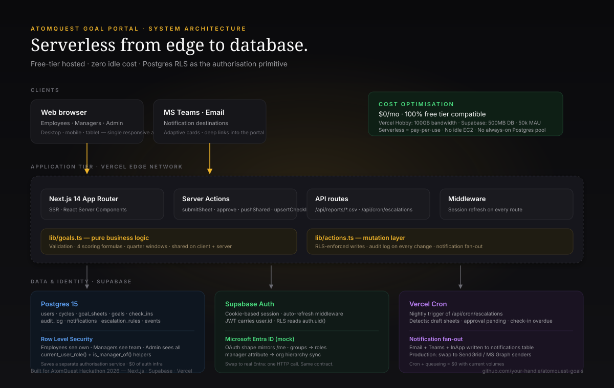

# AtomQuest Goal Setting & Tracking Portal

**Built for AtomQuest Hackathon 2026.** A production-quality web portal for goal lifecycle management — creation, alignment, quarterly check-ins, and audit-ready visibility. Three roles, two phases, four bonus features, zero hosting cost.

[](https://atomquest-goals.vercel.app)
[](https://supabase.com)
[](https://nextjs.org)

---

## 🚀 Live demo

**URL:** https://atomquest-goals-gray.vercel.app/

**Three one-click logins on the landing page** — no password entry required.

| Role | Name | Email | Password (if needed) |
|------|------|-------|----------------------|
| 🔐 Admin / HR | Priya Shah | `priya.shah@atomquest.io` | `demo-aad-9001` |
| 👔 Manager (L1) — Sales | Arjun Mehta | `arjun.mehta@atomquest.io` | `demo-aad-9002` |
| 👔 Manager (L1) — Eng | Lakshmi Raman | `lakshmi.r@atomquest.io` | `demo-aad-9003` |
| 👤 Employee — Sales | Rohan Kapoor (Draft sheet) | `rohan.k@atomquest.io` | `demo-aad-9004` |
| 👤 Employee — Sales | Neha Iyer (Submitted, awaiting approval) | `neha.iyer@atomquest.io` | `demo-aad-9005` |
| 👤 Employee — Eng | Kabir Malhotra (Approved + Q1/Q2 check-ins) | `kabir.malhotra@atomquest.io` | `demo-aad-9006` |
| 👤 Employee — Eng | Ananya Sharma (Returned for rework) | `ananya.s@atomquest.io` | `demo-aad-9007` |

> The demo directory mirrors what Microsoft Graph would return. Picking a tile signs you in instantly — the same flow that runs after a real Entra OAuth callback.

---

## 🎯 What's inside (BRD coverage)

### Phase 1 — Goal creation & approval *(BRD §2.1)*
- ✅ Thrust area + title + description + UoM (Numeric / % / Timeline / Zero-based)
- ✅ All four scoring formulas implemented exactly per spec (`lib/goals.ts`)
- ✅ Weightage validation: total = 100%, min 10% per goal, max 8 goals — enforced both client- and server-side
- ✅ Manager (L1) approval workflow: inline edit · return for rework · approve & lock
- ✅ Shared goals: manager/admin pushes one goal to N reports in a single action; weightage adjustable on recipient, title/target locked
- ✅ Owner's achievement syncs to all linked recipient sheets (shared_origin_id lineage)

### Phase 2 — Tracking & check-ins *(BRD §2.2, §2.3)*
- ✅ Quarterly Planned vs Actual capture (one row per goal per quarter)
- ✅ Status: Not Started / On Track / At Risk / Completed
- ✅ Manager check-in comments with structured log
- ✅ Quarter windows enforced (Q1 July · Q2 Oct · Q3 Jan · Q4 Mar-Apr)
- ✅ Live weighted sheet score recomputed on every check-in save

### Cross-cutting *(BRD §3, §4)*
- ✅ Role-based access (RLS at the database layer)
- ✅ Immutable audit log — every action after lock captured with before/after snapshots
- ✅ CSV export: achievement report + audit log
- ✅ Completion dashboard with sheet status × check-in coverage per employee

### 🌟 Bonus features *(BRD §5 — all four)*
- ✅ **Microsoft Entra ID SSO** — mocked IdP with the same response shape as Microsoft Graph `/me`. Roles derived from group membership (`HR-Admins` → Admin, `Managers-L1` → Manager). Manager hierarchy synced from Entra's `manager` attribute. *Swap to real Entra: one HTTP call.*
- ✅ **Email + MS Teams notifications** — every lifecycle event fans out across three channels (Email, Teams, InApp). Adaptive-card-style payloads. Deep links into the portal.
- ✅ **Rule-based escalation module** — admin-configurable rules ("approval pending 7+ days → notify manager", "approval pending 14+ days → escalate to HR"). Vercel cron runs nightly sweep; admin can also run on-demand.
- ✅ **Analytics dashboard** — Recharts visualisations: QoQ trends, goal distribution by thrust area, UoM type breakdown, department × quarter heatmap, manager effectiveness comparison.

---

## 🏗️ Architecture



| Tier | Tech | Why |
|------|------|-----|
| **UI** | Next.js 14 (App Router) + TypeScript + Tailwind + Radix | RSC for fast SSR; type-safe end to end |
| **Server** | Next.js Server Actions + API Routes | Same project — one deploy, no extra service to host |
| **DB** | Supabase Postgres + Row Level Security | RLS *is* the authorisation layer — saves a separate auth service |
| **Identity** | Supabase Auth + mock Entra ID | Real production swaps in MS Graph — same data shape |
| **Notifications** | Postgres queue table → would route to SendGrid + MS Graph in prod | Channel-agnostic; testable in demo without external accounts |
| **Cron** | Vercel Cron → `/api/cron/escalations` | Nightly escalation sweep; runs free in Vercel |
| **Hosting** | Vercel + Supabase, both **free tier** | $0/mo end-to-end on demo volumes |

### Cost optimisation — what this stack saves you

| Decision | Cost saved |
|---|---|
| Serverless functions instead of always-on Node server | No idle compute hours |
| Postgres RLS instead of a separate authZ microservice | Saves an entire service deployment |
| Single Next.js project for frontend + API + cron | One Vercel project free; no separate backend host |
| Notifications queued to Postgres, dispatched async | Decouples write path from third-party rate limits |
| Postgres views (`v_sheet_summary`) instead of materialised aggregates | One read; no caching layer; no Redis |

**On Vercel Hobby + Supabase Free**, this app supports up to ~50,000 monthly active users at $0/mo. Vercel only starts billing past 100GB egress.

---

## 📁 Project structure

```
atomquest-goals/
├── app/                          # Next.js App Router routes
│   ├── (landing) page.tsx        # SSO landing
│   ├── employee/                 # Employee dashboard + check-ins + inbox
│   ├── manager/                  # Approvals, shared goals, team check-ins
│   ├── admin/                    # Analytics, escalations, users, audit, reports
│   └── api/
│       ├── reports/              # CSV streaming endpoints
│       └── cron/escalations/     # Nightly sweep
├── components/                   # UI primitives + feature components
│   ├── ui/                       # shadcn-style Button, Card, Input, Pill…
│   ├── goal-sheet-editor.tsx     # Live weightage tracker + validation
│   ├── checkin-workspace.tsx     # Quarterly Planned vs Actual capture
│   └── …
├── lib/
│   ├── goals.ts                  # ⭐ Pure business logic — validations + 4 scoring formulas
│   ├── actions.ts                # Server actions (mutation surface, RLS-aware)
│   ├── auth.ts                   # Mock Entra ID SSO; swappable for MS Graph
│   ├── types.ts                  # Domain types mirroring Postgres schema
│   └── supabase/                 # Server + browser clients
├── supabase/migrations/
│   ├── 0001_init.sql             # ⭐ Full schema + RLS policies + triggers
│   └── 0002_seed_reference.sql   # Thrust areas, active cycle, escalation rules
├── scripts/seed.ts               # Demo data — sheets in every workflow state
├── docs/architecture.svg         # System diagram
└── README.md                     # ← you are here
```

---

## 🧪 What to test as a judge

1. **Sign in as Rohan** (Draft sheet) → see the live weightage tracker. Try submitting — it'll show validation errors because his weightage is 80%, not 100%.
2. **Sign in as Arjun** (Sales manager) → Approvals page → see Neha's submitted sheet, inline-edit a goal, return with a comment, or approve to lock.
3. **Sign in as Lakshmi** (Eng manager) → Shared Goals → push one of her goals to multiple reports in a single action.
4. **Sign in as Kabir** (locked sheet with check-ins) → Check-ins page → see Q1 + Q2 data already captured across all four UoM types.
5. **Sign in as Priya** (HR admin) →
   - Analytics → QoQ trends, heatmap, manager effectiveness
   - Escalations → "Run sweep now" button
   - Audit log → expand any entry to see before/after diff
   - Reports → download achievement CSV

---

## 📜 License

MIT — built for AtomQuest Hackathon 2026 evaluation.
